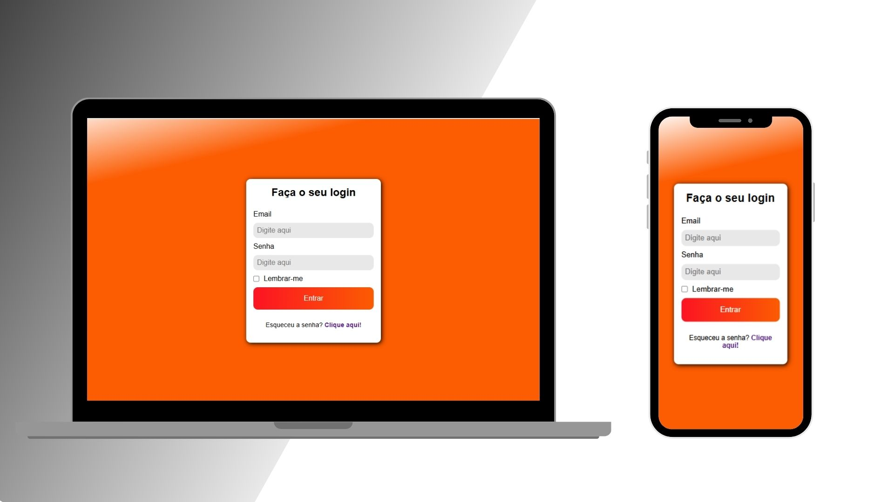

# Formulário de Login Responsivo

Este projeto é um formulário de login desenvolvido com **HTML** e **CSS puro**, focado em **responsividade**, **acessibilidade básica** e **organização semântica**.

---

## Funcionalidades

- Layout centralizado com `Flexbox`
- Design responsivo (breakpoint até 400px)
- Estilização com `linear-gradient` e `box-shadow`
- Campos:
  - Email (obrigatório)
  - Senha (obrigatório)
  - Checkbox “Lembrar-me”
  - Link de recuperação de senha
- Interface clara, legível e adaptável a telas menores

---

